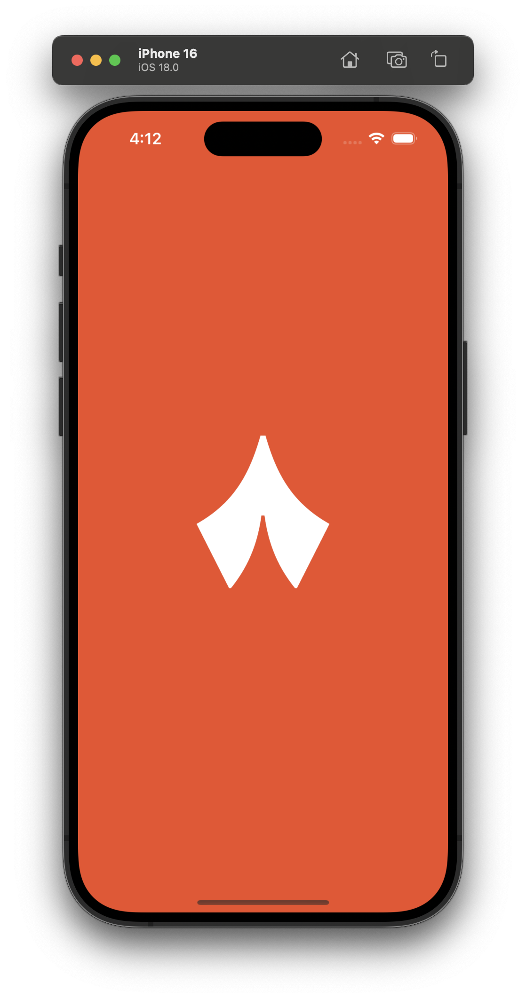
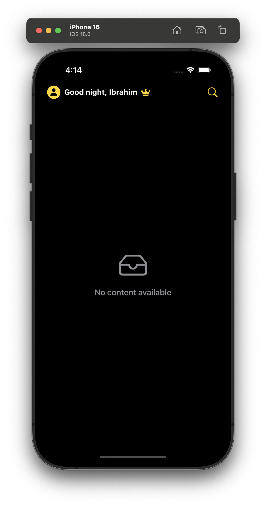
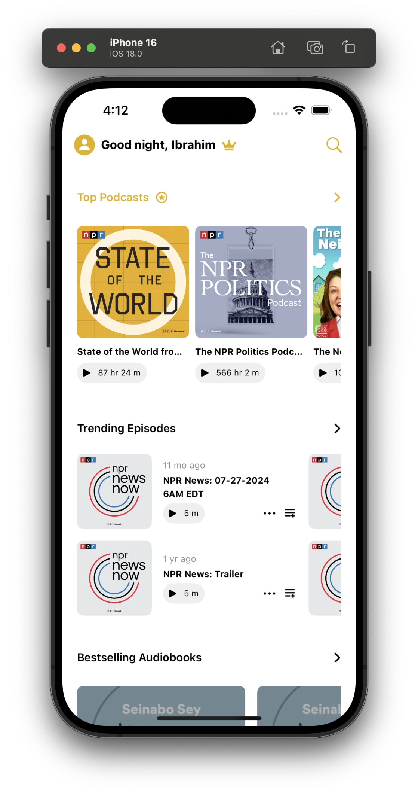
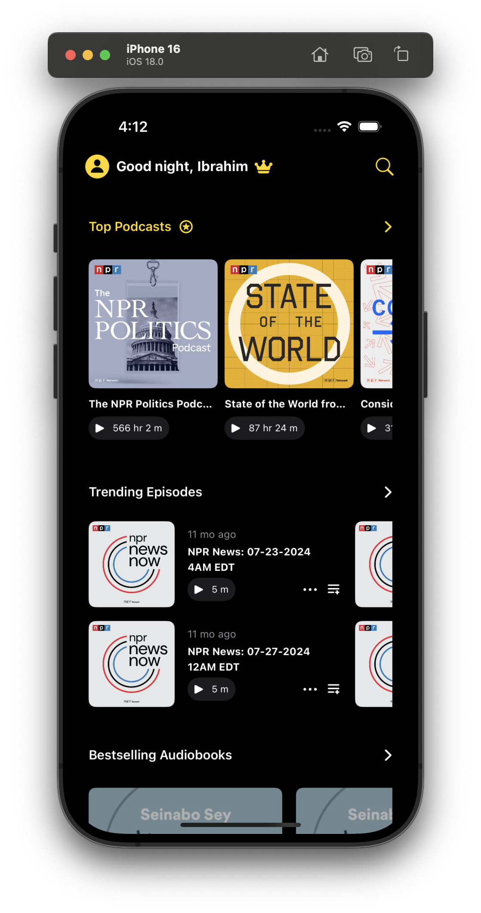
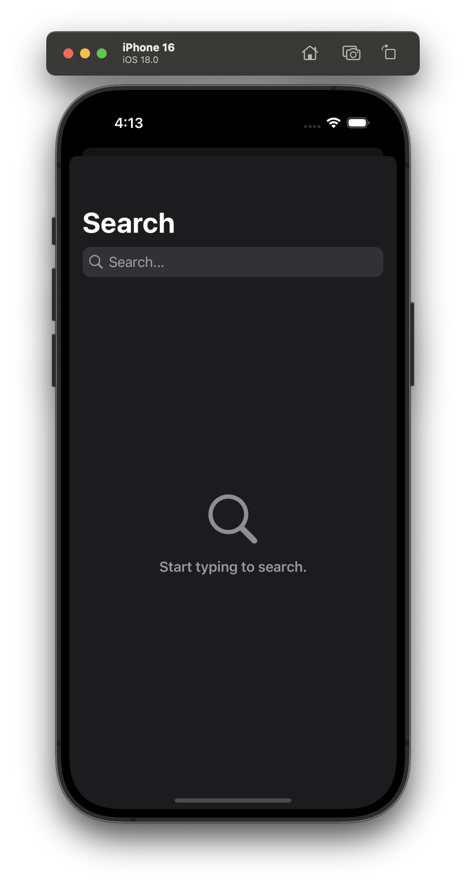
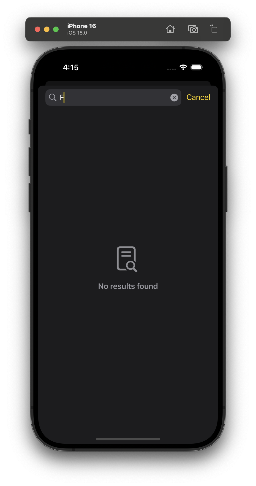
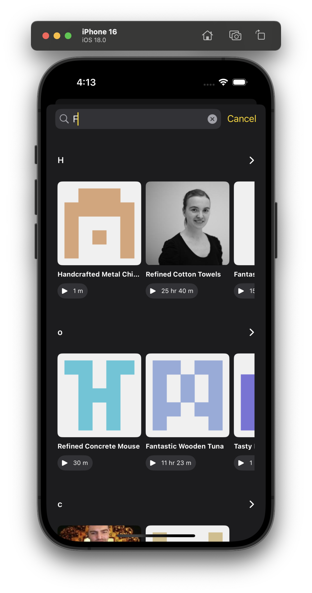
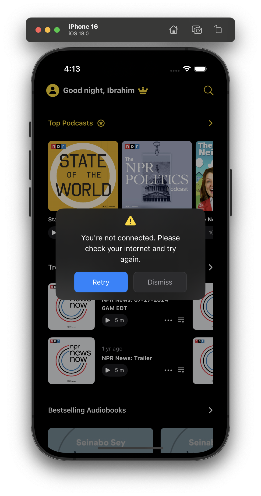

## 🧭 Index

- [📱 Thmanyah iOS App](#-thmanyah-ios-app)
- [🎯 Project Overview](#-project-overview)
- [✨ Features](#-features)
  - [🏠 Home Screen](#-home-screen)
  - [🔍 Search Functionality](#-search-functionality)
  - [🧹 Code Quality](#-code-quality)
  - [🎨 Features](#-features-1)
- [📱 Screenshots](#-screenshots)
- [📋 Assignment Checklist](#-assignment-checklist)
- [🏗️ Architecture](#-architecture)
- [🛠️ Technical Stack](#-technical-stack)
- [📁 Project Structure](#-project-structure)
- [🔗 API Endpoints](#-api-endpoints)
- [🧪 Testing Strategy](#-testing-strategy)
- [🎨 UI Components](#-ui-components)
- [📊 Performance Considerations](#-performance-considerations)
- [🚧 Development Challenges & Solutions](#-development-challenges--solutions)
- [🚀 Future Improvements](#-future-improvements)


# 📱 Thmanyah iOS App

A modern iOS application built with SwiftUI and MVVM architecture, featuring dynamic content sections, search functionality, and comprehensive testing.

## 🎯 Project Overview

Thmanyah is an iOS application that displays dynamic content sections including podcasts, audio articles, audio books, and episodes. The app features a clean, modern UI with infinite scrolling, search functionality, and robust error handling.

## ✨ Features

### 🏠 Home Screen
- **Dynamic Sections**  
  Renders various content types such as grid, list, square, and big square layouts based on API configuration.
- **Infinite Scrolling**  
  Supports seamless pagination as users scroll through content.
- **Real-Time Data**  
  Fetches updated content directly from the backend API.
- **Responsive Design**  
  Fully adaptive layout optimized for different screen sizes and orientations.

### 🔍 Search Functionality
- **Debounced Search Input**  
  Adds a 200ms debounce to reduce redundant API calls while typing.
- **Live Result Updates**  
  Displays search results in real time with each keystroke.
- **Consistent Visual Design**  
  Maintains the same layout patterns as the home screen for familiarity.
- **Request Caching**  
  Prevents repeated requests for identical search terms to improve performance.

### 🧹 Code Quality
- **Enforced Style with SwiftLint** 🛠  
  SwiftLint is integrated into the project to enforce consistent code style and catch potential issues early. It ensures the codebase stays clean, readable, and maintainable across all modules.

### 🎨 Features
- **Dark & Light Mode Support**  
  Automatically adapts UI to match the system appearance.
- **Pull to Refresh**  
  Allows users to refresh content manually via swipe gesture.
- **Task Cancellation**  
  Cancels running async tasks when necessary to optimize performance and UX.
- **Unified Theming System**  
  Centralized accent colors and typography for consistent branding.
- **Custom Splash Screen**  
  Enhanced launch experience with a visually branded splash view.
- **SwiftLint Integration**  
  Enforces code style and structure through automated linting, ensuring consistent and readable UI codebase.


## 📱 Screenshots

### 🚀 App Launch
| Splash Screen |
|:-------------:|
|  |

### 🏠 Home Screen States
| Empty Home | Light Mode | Dark Mode |
|:----------:|:----------:|:---------:|
|  |  |  |

### 🔍 Search Screen States
| Search Empty | No Results | Search Results |
|:------------:|:----------:|:---------------:|
|  |  |  |

### ⚠️ Error State
| Error Overlay |
|:-------------:|
|  |


## 📋 Assignment Checklist

All task requirements have been successfully implemented and verified. ✅

### ✅ Core Features
- [x] **Main Screen** with dynamic sections  
- [x] **API Integration** with GET requests  
- [x] **UI Updates** based on section type  
- [x] **Unit Tests** for business logic  
- [x] **Search Screen** with debounced search  

### ✅ Technical Requirements
- [x] **MVVM Architecture**  
- [x] **SwiftUI** for UI development  
- [x] **Swift Concurrency** (async/await)  
- [x] **Swift Package Manager** for dependencies  

### ✅ Optional Enhancements
- [x] **UI Tests** implemented  
- [x] **Mix of UIKit and SwiftUI** where appropriate (UIKit in `RetryErrorOverlay`)  

### ✅ Documentation
- [x] **Solution explanation** in README  
- [x] **Challenges documented**  
- [x] **Future improvements** suggested  


## 🏗️ Architecture

### MVVM Pattern
- **Model**: Data models and business logic
- **View**: SwiftUI views for UI presentation
- **ViewModel**: State management and data binding

### Clean Architecture
```
┌─────────────────────────────────────────────────────────────┐
│                    Presentation Layer                      │
│  ┌─────────────┐  ┌─────────────┐  ┌─────────────┐      │
│  │   HomeView  │  │ SearchView  │  │ Components  │      │
│  └─────────────┘  └─────────────┘  └─────────────┘      │
└─────────────────────────────────────────────────────────────┘
┌─────────────────────────────────────────────────────────────┐
│                     Domain Layer                           │
│  ┌─────────────┐  ┌─────────────┐  ┌─────────────┐      │
│  │ HomeUseCase │  │SearchUseCase│  │  Models      │      │
│  └─────────────┘  └─────────────┘  └─────────────┘      │
└─────────────────────────────────────────────────────────────┘
┌─────────────────────────────────────────────────────────────┐
│                     Data Layer                             │
│  ┌─────────────┐  ┌─────────────┐  ┌─────────────┐      │
│  │ Repository  │  │ APIService  │  │    DTOs     │      │
│  └─────────────┘  └─────────────┘  └─────────────┘      │
└─────────────────────────────────────────────────────────────┘
┌─────────────────────────────────────────────────────────────┐
│                   Network Layer                            │
│  ┌─────────────┐  ┌─────────────┐  ┌─────────────┐      │
│  │NetworkService│  │   Logger    │  │   Errors    │      │
│  └─────────────┘  └─────────────┘  └─────────────┘      │
└─────────────────────────────────────────────────────────────┘
```

### Dependency Injection
- **AppDIContainer**: Main dependency container
- **Module-specific containers**: Home and Search modules have their own DI containers
- **Protocol-based design**: Easy testing and modularity

## 🛠️ Technical Stack

### Core Technologies
- **SwiftUI**: Modern declarative UI framework
- **Swift Concurrency**: async/await for asynchronous operations
- **MVVM Architecture**: Clean separation of concerns
- **Swift Package Manager**: Dependency management

### Network Layer
- **Custom Network Layer**: Built with URLSession
- **Error Handling**: Comprehensive error types and messages
- **Logging**: Network request/response logging
- **Mock Support**: Easy testing with mock protocols

### Testing
- **Unit Tests**: Business logic and view models
- **UI Tests**: End-to-end user interactions
- **Mock Factories**: Comprehensive test data generation

## 📁 Project Structure

```
Thmanyah/
├── NetworkLayer/           # Custom network layer package
├── Thmanyah/              # Main app target
│   ├── App/               # App entry point
│   ├── Modules/           # Feature modules
│   │   ├── Home/          # Home screen module
│   │   └── Search/        # Search screen module
│   ├── Shared/            # Shared components and utilities
│   └── Theme/             # App theming and assets
├── ThmanyahTests/         # Unit tests
└── ThmanyahUITests/       # UI tests
```


## 🔗 API Endpoints

### Home Sections
- **URL**: `https://api-v2-b2sit6oh3a-uc.a.run.app/home_sections`
- **Method**: GET
- **Description**: Fetches dynamic content sections for the main screen

### Search
- **URL**: `https://mock.apidog.com/m1/735111-711675-default/search`
- **Method**: GET
- **Parameters**: `query` (search term)
- **Description**: Performs search across all content types

## 🧪 Testing Strategy

### Unit Tests
- **ViewModels**: State management and business logic
- **UseCases**: Business rules and data transformation
- **Repositories**: Data access and caching logic
- **Network Layer**: Request/response handling

### UI Tests
- **Home Screen**: Navigation and content display
- **Search Screen**: Search functionality and results

## 🎨 UI Components

### Reusable Components
- **AsyncImageView**: Image loading with caching
- **HorizontalScrollList**: Horizontal scrolling content
- **Section Headers**: Dynamic header rendering
- **Loading Indicators**: Consistent loading states
- **Error Overlays**: User-friendly error messages (UIKit wrapped with SwiftUI)
- **Generic Empty States**: Reusable empty state components
- **SwiftUI Modifiers**: Loading and error state modifiers

### Section Renderers
- **SquareSection**: Podcast and article content
- **BigSquareSection**: Featured content
- **TwoLineGrid**: Episode and audio book content
- **QueueSection**: Playlist-style content


## 📊 Performance Considerations

### Memory Management
- **Image Caching**: Efficient image loading and caching
- **Lazy Loading**: Content loaded on demand
- **Memory Cleanup**: Proper disposal of resources

### Network Optimization
- **Request Debouncing**: Prevents redundant API calls
- **Response Caching**: Reduces network overhead
- **Error Retry**: Automatic retry for failed requests

## 🚧 Development Challenges & Solutions

Throughout the development process, several technical challenges emerged. This section outlines key issues and the solutions implemented to address them.

### 🔧 Technical Challenges

#### 1. API Response Normalization  
- **Problem**: The API returned inconsistent values for the same content type (e.g., `"2_lines_grid"` vs `"2 lines grid"`).  
- **Solution**: Applied a normalization step by replacing underscores (`_`) with spaces to ensure consistent decoding and rendering logic.

#### 2. Dynamic UI Rendering  
- **Problem**: Sections and headers required rendering different layouts at runtime.  
- **Solution**: Utilized the **Factory Pattern** to dynamically construct views based on content type, enabling flexible and scalable UI rendering.

#### 3. Code Maintainability  
- **Problem**: Business logic, networking, and UI were tightly coupled, making the code hard to maintain.  
- **Solution**: Adopted **Clean Architecture** to separate responsibilities across Data, Domain, and Presentation layers.

#### 4. Empty State Handling  
- **Problem**: Various empty states were needed depending on user interactions and data availability.  
- **Solution**: Created generic, customizable empty state views to improve reusability and maintain a consistent UX.

#### 5. Loading & Error States  
- **Problem**: Loading spinners and error messages were duplicated across multiple views.  
- **Solution**: Abstracted this logic into reusable **SwiftUI ViewModifiers** for a cleaner and more consistent implementation.

#### 6. Dependency Injection  
- **Problem**: Managing dependencies across views and features became increasingly complex.  
- **Solution**: Introduced a centralized **Dependency Injection Container** to simplify dependency management and improve testability.

#### 7. Code Duplication Between Features  
- **Problem**: Home and Search features had redundant models and UI components.  
- **Solution**: Unified them by mapping different DTOs to shared domain models and using reusable view components.

#### 8. Image Caching  
- **Problem**: `AsyncImage` lacked efficient caching, leading to poor performance.  
- **Solution**: USe Kingfisher to optimize performance, reduce network load and offer image caching.


## 🚀 Future Improvements

This section outlines planned enhancements to improve modularity, maintainability, and overall code quality of the project.

- [ ] **Modular String Catalogs**  
  Introduce a separate String Catalog for each feature to improve localization workflows and text management consistency.

- [ ] **Navigation Coordination Layer**  
  Implement a Coordinator pattern to centralize and simplify navigation logic across the app.

- [ ] **Feature-Based Modularization**  
  Refactor the codebase so each feature resides in its own Swift module, improving testability and separation of concerns.

- [ ] **ThmanyahTheme Module**  
  Build a shared design system module for fonts, colors, spacing, and reusable UI components to ensure consistent UI/UX.

- [ ] **Comprehensive UI Testing**  
  Expand test coverage to include all user journeys, accessibility checks, and edge cases.

- [ ] **Dependency Injection Integration**  
  Integrate third-party DI solutions like [Factory](https://github.com/hmlongco/Factory) or [Swinject](https://github.com/Swinject/Swinject) for more flexible and decoupled code architecture.

- [ ] **Registry Design Pattern for UI Rendering**  
  Replace the current Factory pattern with a **Registry pattern** to simplify content-type-to-view mapping and avoid verbose `switch` statements—making it easier to extend without modifying existing logic.

- [ ] **Advanced Unit Testing**  
  Implement thorough unit tests covering core business logic, failure scenarios, and performance-critical paths.

- [ ] **Multi-Environment Configuration**  
  Set up multiple build targets and configuration files (`.xcconfig`) for Debug, Release, and potential staging environments.
